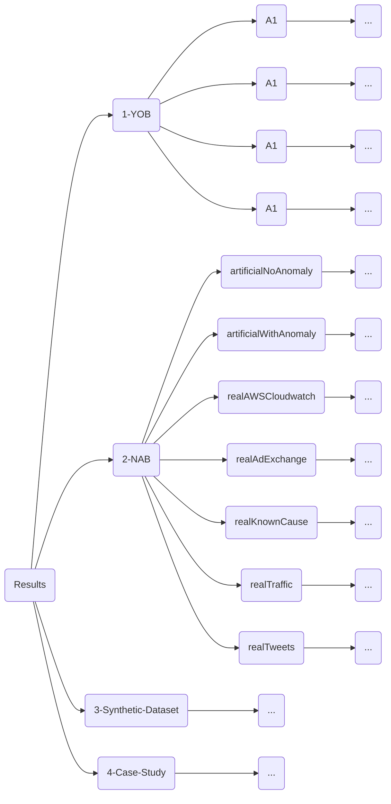

# Guia Sobre Ferramentas em Geral

https://gitter.im/guia-estudos/community

https://github.com/mermaid-js/mermaid/blob/develop/README.md

https://mermaid-js.github.io/mermaid/#/

https://mermaid-js.github.io/mermaid-live-editor/

https://github.com/mermaidjs/mermaid.cli

Software para adicionar aplicações como serviços do Windows:

Windows Service Wrapper: https://github.com/winsw/winsw

Alguns sites importantes: 

* https://coolbackgrounds.io/
* https://toffeeshare.com/
* https://www.watermarkremover.io/pt
* https://snapdrop.net/
* https://thispersondoesnotexist.com/
* https://www.invertexto.com/
* https://namelix.com/
* https://www.4devs.com.br/
* https://magicstudio.com/magiceraser
* https://gravadordetela.com/ - para gravar a tela do computador
* https://imgur.com/upload - para upload de imagens

Sites para criação de imagens artísticas: 

* https://www.midjourney.com/ - para criação de imagens
* https://discord.com/
